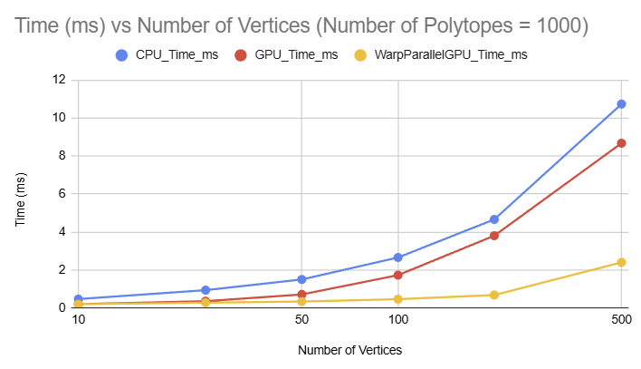
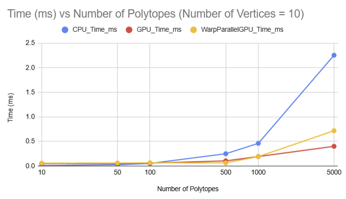
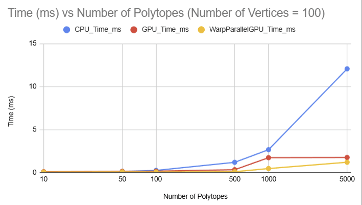

# OpenGJK-GPU

CUDA implementation of [openGJK](https://github.com/MattiaMontanari/openGJK).

## Port Summary

### Key Changes from Original openGJK

1. **Memory Layout**: Changed from double-pointer `gkFloat** coord` to flattened array `gkFloat* coord` for GPU compatibility
   - Added `getCoord(body, index, component)` macro for array access: `body->coord[(index) * 3 + (component)]`

2. **Function Decorators**: Added `__device__` to all 17 helper functions (determinant, crossProduct, S1D, S2D, S3D, support, subalgorithm, W0D-W3D, compute_witnesses)

3. **Kernel Signature**: Changed from CPU function to `__global__` kernel:
   ```cuda
   __global__ void compute_minimum_distance(gkPolytope* polytopes1, gkPolytope* polytopes2,
                                             gkSimplex* simplices, gkFloat* distances, int n);
   ```

4. **Performance Optimization**: Changed to copy-by-value for polytopes and simplices to keep data in registers/local memory instead of global memory

5. **Precision Macros**: Added `gkSqrt` macro for float/double precision handling

6. **Code Structure**: GPU wrapper in `GJK::GPU` namespace with built-in CUDA timing support

7. **Warp Parallel Implementation** Added warpParallelGJK.cu and warpParallelGJK.h which use 16 threads per polytope-polytope collision. Currently main speedup over normal GPU implementation is from parallelising the support function calls.

## CPU Baseline Implementation

The CPU baseline in `GJK/cpu/` was adapted from the original openGJK to use the common flattened memory layout:

**Critical Changes:**
- **Coordinate access pattern**: Changed from `coord[i]` (double pointer) to `&coord[i * 3]` (single pointer with stride)
  - Modified in: `support()`, `W0D()`, `W1D()`, `W2D()`, `W3D()`, and `compute_minimum_distance()` initialization
- **Build system**: Added C language support to CMake for proper C compilation


## Graphs

We generate graphs for comparing the run time of the different implementations across different numbers of polytopes and numbers of vertices. Note that the way we created polytopes to run the implementations on involved generating new sets of polytopes for each combination of numbers of polytopes and numbers of vertices. Because of this comparing the same implementation across different parameters is not straightforward because the GPU runtime is largely dependent on the single polytope-polytope collision that takes the longest time to run. This means an especially complex collision could be generated even with a small number of polytopes/vertices causing the runtime to be longer than future testing with a higher number of polytopes/vertices. We will conduct more robust and standardized testing moving forwards to help prevent this.

||||
|:--:|:--:|:--:|

## Diagrams


||
|:--:|
| *Warp Parallel GPU Implementation Block Diagram* |

## Precision Configuration

To switch between 32-bit (float) and 64-bit (double) precision, edit `GJK/common.h` line 10:
- **32-bit**: `#define USE_32BITS`
- **64-bit**: `//#define USE_32BITS`

## Test Results

Performance comparison (1000 polytope pairs, 1000 vertices each):

```
OpenGJK Performance Testing
============================
Polytopes: 1000
Vertices per polytope: 1000
Precision: 32-bit (float)


================================================================================
                           EXECUTION TIMES
================================================================================
Regular GPU:               3.4191 ms
Warp-Parallel GPU:         0.9624 ms
CPU:                       12.1139 ms

================================================================================
                          PERFORMANCE COMPARISON
================================================================================
Warp-Parallel vs Regular GPU:  3.55x faster (warp-parallel wins)
CPU vs Regular GPU:            3.54x speedup
CPU vs Warp-Parallel GPU:      12.59x speedup

================================================================================
                            VALIDATION RESULTS
================================================================================
Regular GPU vs CPU:        PASSED (first 100 results within 1e-05 tolerance)
Warp-Parallel GPU vs CPU:  PASSED (first 100 results within 1e-05 tolerance)

================================================================================
                            DISTANCE RESULTS
================================================================================
Regular GPU:
  Distance (first pair):   5.655237
  Distance (last pair):    6.642425
  Witnesses (first pair):  (-3.503, 0.591, -2.867) and (1.812, 0.588, -0.935)

Warp-Parallel GPU:
  Distance (first pair):   5.655237
  Distance (last pair):    6.642425
  Witnesses (first pair):  (-3.503, 0.591, -2.867) and (1.812, 0.588, -0.935)

CPU:
  Distance (first pair):   5.655237
  Distance (last pair):    6.642425
  Witnesses (first pair):  (-3.503, 0.591, -2.867) and (1.812, 0.588, -0.935)
================================================================================

Testing complete!
```

The validation automatically compares the first 100 distance computations between GPU and CPU implementations, confirming correctness of the GPU port.

* **Tested On:**
  * OS: Windows 11
  * CPU: AMD Ryzen 7 5800H with Radeon Graphics (8C/16T, 3.2GHz base)
  * RAM: 32GB DDR4
  * GPU: NVIDIA GeForce RTX 3060 Laptop GPU (6GB GDDR6)
  * CUDA Toolkit: 13.0
  * Driver Version: 581.15