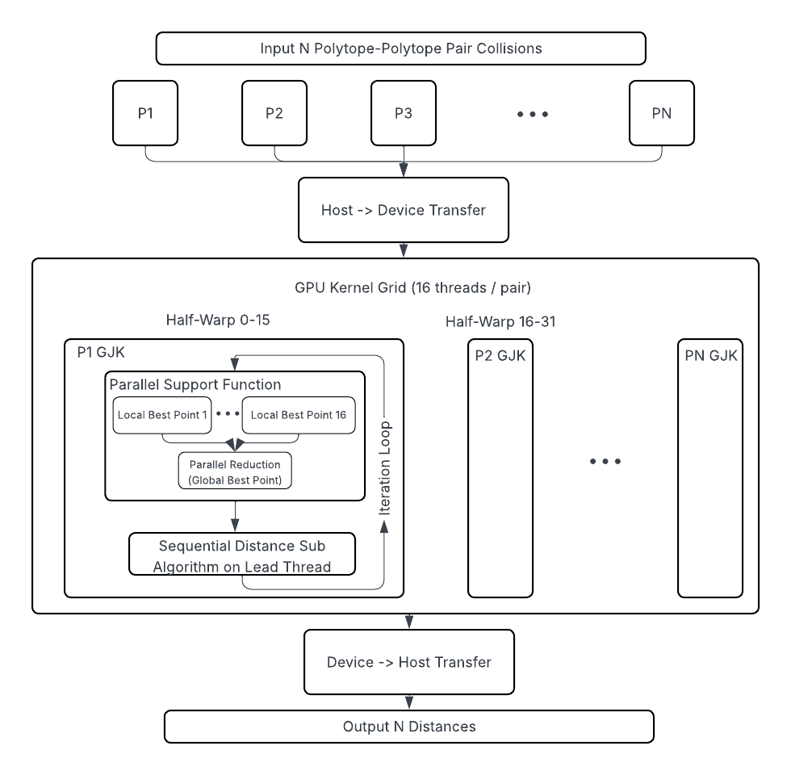

*This repo is currently a work in progress.*
# OpenGJK-GPU

CUDA implementation of [openGJK](https://github.com/MattiaMontanari/openGJK).

## CPU Baseline Implementation

The CPU baseline in `GJK/cpu/` was adapted from the original openGJK to use the common flattened memory layout:

**Critical Changes:**
- **Coordinate access pattern**: Changed from `coord[i]` (double pointer) to `&coord[i * 3]` (single pointer with stride)
  - Modified in: `support()`, `W0D()`, `W1D()`, `W2D()`, `W3D()`, and `compute_minimum_distance()` initialization
- **Build system**: Added C language support to CMake for proper C compilation

## Port Summary

### Key Changes from Original openGJK

1. **Memory Layout**: Changed from double-pointer `gkFloat** coord` to flattened array `gkFloat* coord` for GPU compatibility
   - Added `getCoord(body, index, component)` macro for array access: `body->coord[(index) * 3 + (component)]`

2. **Function Decorators**: Added `__device__` to all 17 helper functions (determinant, crossProduct, S1D, S2D, S3D, support, subalgorithm, W0D-W3D, compute_witnesses)

3. **Kernel Signature**: Changed from CPU function to `__global__` kernel:
   ```cuda
   __global__ void compute_minimum_distance(gkPolytope* polytopes1, gkPolytope* polytopes2,
                                             gkSimplex* simplices, gkFloat* distances, int n);
   ```

4. **Performance Optimization**: Changed to copy-by-value for polytopes and simplices to keep data in registers/local memory instead of global memory

5. **Precision Macros**: Added `gkSqrt` macro for float/double precision handling

6. **Code Structure**: GPU wrapper in `GJK::GPU` namespace with built-in CUDA timing support

7. **Warp Parallel Implementation** Added warpParallelGJK.cu and warpParallelGJK.h which use 16 threads per polytope-polytope collision. Currently main speedup over normal GPU implementation is from parallelising the support function calls.

7. **Warp Parallel EPA Implementation** Implemented `compute_epa_warp_parallel` kernel using one warp (32 threads) per collision.

## EPA (Expanding Polytope Algorithm) Implementation

### Current Status
- **Warp-Parallel EPA**: Implemented `compute_epa_warp_parallel` kernel using one warp (32 threads) per collision
- **Integration**: EPA is called automatically after GJK when a collision is detected (returned distance is 0.00)
- **Functionality**: Computes penetration depth and witness points for overlapping polytopes

### Key Implementation Details
- **Polytope Structure**: Uses `EPAPolytope` with up to 128 faces and dynamic vertex expansion
- **Parallel Operations**:
  - Face normal/distance computation distributed across warp threads
  - Support function calls parallelized using all 32 threads
  - Horizon edge detection optimized with single-pass edge collection and duplicate removal
- **Synchronization**: Lane 0 (first thread) maintains authoritative polytope state; other threads assist with parallel support calls
- **Convergence**: Iterates until penetration depth improvement is below tolerance or max iterations (64) reached

### Current Limitations / Known Issues
- **Degenerate Cases**: Handling of edge cases (e.g., simplices with < 4 vertices from GJK) needs more robust error handling
- **Witness Points**: Witness point doesn't always seem to be correct. Possibly an error in the GJk implementation too.
- **Performance**: Horizon reconstruction currently runs sequentially on lane 0; potential for further parallelization
- **Testing**: Basic test cases implemented; comprehensive validation against reference implementations still in progress

### API
The EPA functionality is accessible through `GJK::GPU::computeGJKAndEPA()` which:
1. Runs GJK to detect collisions
2. Automatically calls EPA for colliding polytopes (simplex with 4 vertices)
3. Returns penetration depths (negative values) and witness points for collisions
4. Returns separation distances (positive values) for non-colliding polytopes


## Graphs

Performance comparison across different configurations (1000 polytopes or 1000 vertices fixed):

|||
|:--:|:--:|

Note: Linear y-axis plots compress lower timing values, making comparisons difficult. Log-log plots below show full range:

|||
|:--:|:--:|
|||
|||

Notice how the GPU-versions, especially the warp-parallel version are consistently faster for nearly all of our testing. The differences get larger as the number of vertices/polytopes get larger. The warp-parallel GJK consistently outperforms all other algorithms. Also, note the considerable differences in the timings for 64-bit precision, especially for the GPU algorithms.
## Diagrams


||
|:--:|
| *Warp Parallel GPU Implementation Block Diagram* |

## Precision Configuration

To switch between 32-bit (float) and 64-bit (double) precision, edit `GJK/common.h` line 10:
- **32-bit**: `#define USE_32BITS`
- **64-bit**: `//#define USE_32BITS`

## Test Results

Performance comparison (1000 polytope pairs, 1000 vertices each):

```
OpenGJK Performance Testing
============================
Polytopes: 1000
Vertices per polytope: 1000
Precision: 32-bit (float)


================================================================================
                           EXECUTION TIMES
================================================================================
Regular GPU:               3.4191 ms
Warp-Parallel GPU:         0.9624 ms
CPU:                       12.1139 ms

================================================================================
                          PERFORMANCE COMPARISON
================================================================================
Warp-Parallel vs Regular GPU:  3.55x faster (warp-parallel wins)
CPU vs Regular GPU:            3.54x speedup
CPU vs Warp-Parallel GPU:      12.59x speedup

================================================================================
                            VALIDATION RESULTS
================================================================================
Regular GPU vs CPU:        PASSED (first 100 results within 1e-05 tolerance)
Warp-Parallel GPU vs CPU:  PASSED (first 100 results within 1e-05 tolerance)

================================================================================
                            DISTANCE RESULTS
================================================================================
Regular GPU:
  Distance (first pair):   5.655237
  Distance (last pair):    6.642425
  Witnesses (first pair):  (-3.503, 0.591, -2.867) and (1.812, 0.588, -0.935)

Warp-Parallel GPU:
  Distance (first pair):   5.655237
  Distance (last pair):    6.642425
  Witnesses (first pair):  (-3.503, 0.591, -2.867) and (1.812, 0.588, -0.935)

CPU:
  Distance (first pair):   5.655237
  Distance (last pair):    6.642425
  Witnesses (first pair):  (-3.503, 0.591, -2.867) and (1.812, 0.588, -0.935)
================================================================================

========================================
EPA Algorithm Testing
========================================

Test Case 5: Overlapping polytopes (~50 vertices each)
-----------------------------------

=== GJK Results (before EPA) ===
  Collision 0:
    Simplex vertices: 4
    Distance: 0.000000
    Witness 1: (0.501309, 0.017448, 0.503722)
    Witness 2: (0.501309, 0.017449, 0.503722)
================================

  Simplex vertices: 4
  Distance/Penetration: -0.329734
  Witness 1: (0.480366, -0.027989, 0.269849)
  Witness 2: (0.529449, 0.083507, 0.891680)
  PASS: Collision detected with penetration depth of 0.329734

========================================
EPA Testing Complete
========================================

Testing complete!
```

The validation automatically compares the first 100 distance computations between GPU and CPU implementations, confirming correctness of the GPU port.

* **Tested On:**
  * OS: Windows 11
  * CPU: AMD Ryzen 7 5800H with Radeon Graphics (8C/16T, 3.2GHz base)
  * RAM: 32GB DDR4
  * GPU: NVIDIA GeForce RTX 3060 Laptop GPU (6GB GDDR6)
  * CUDA Toolkit: 13.0
  * Driver Version: 581.80