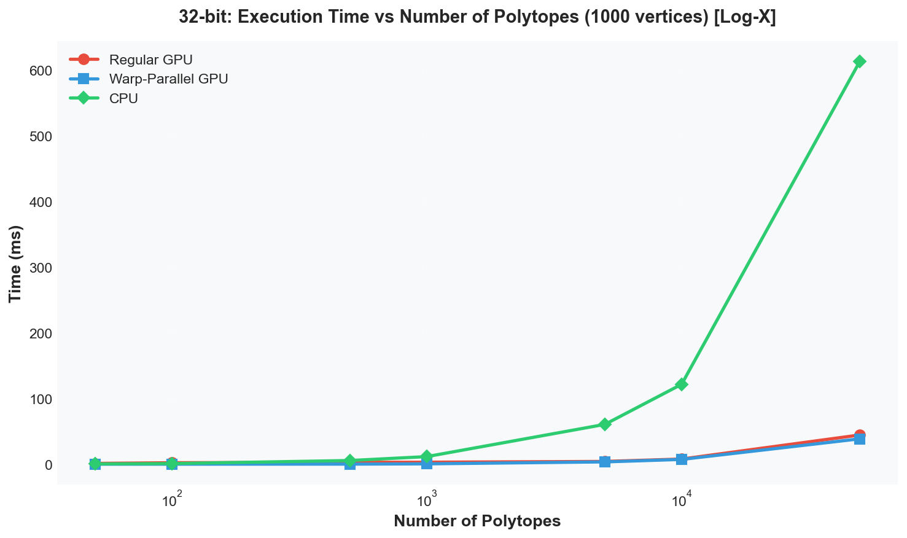
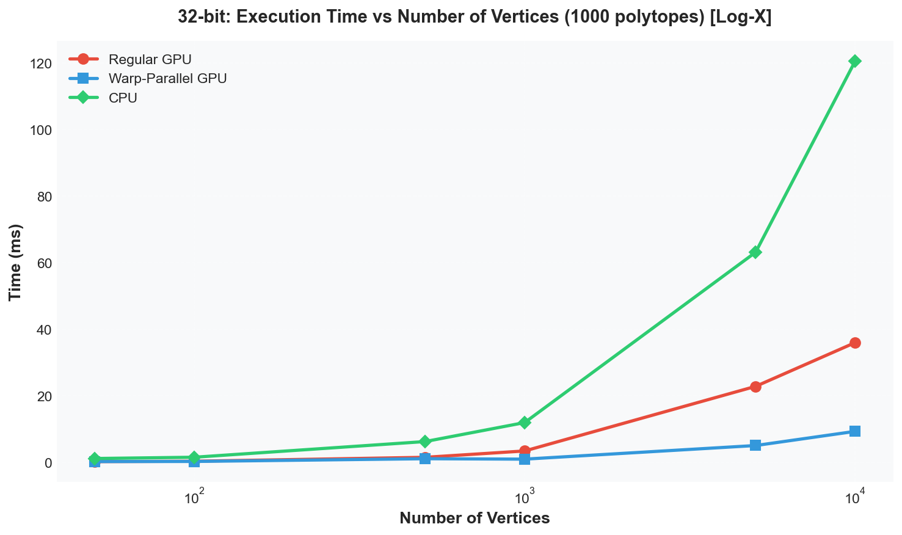
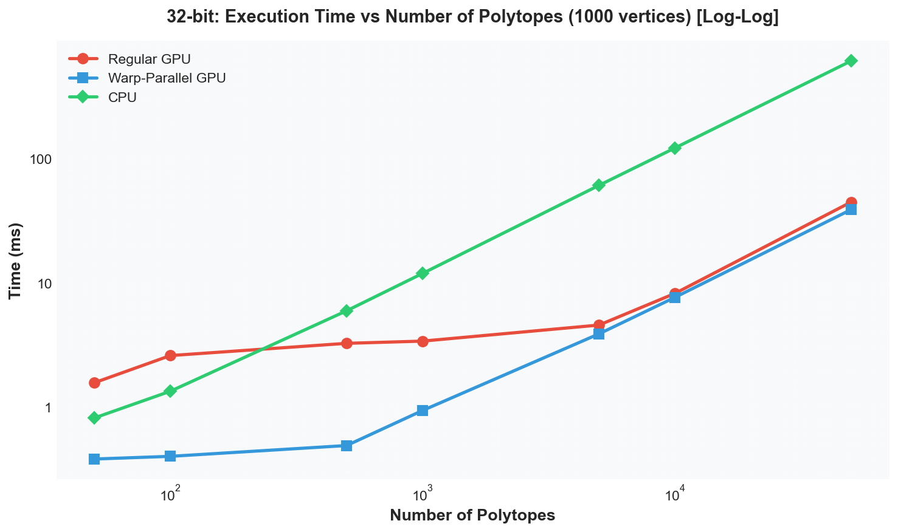
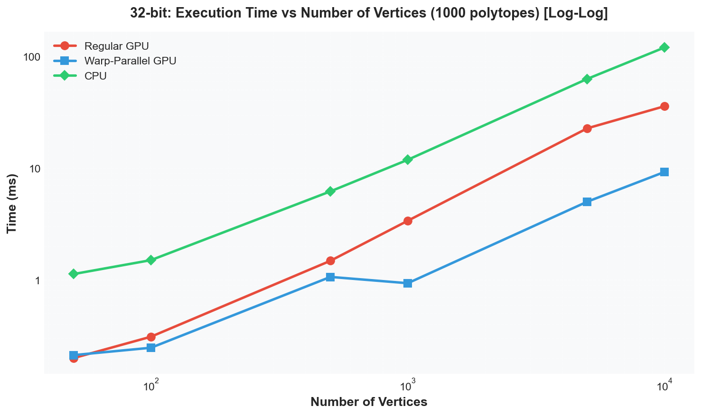
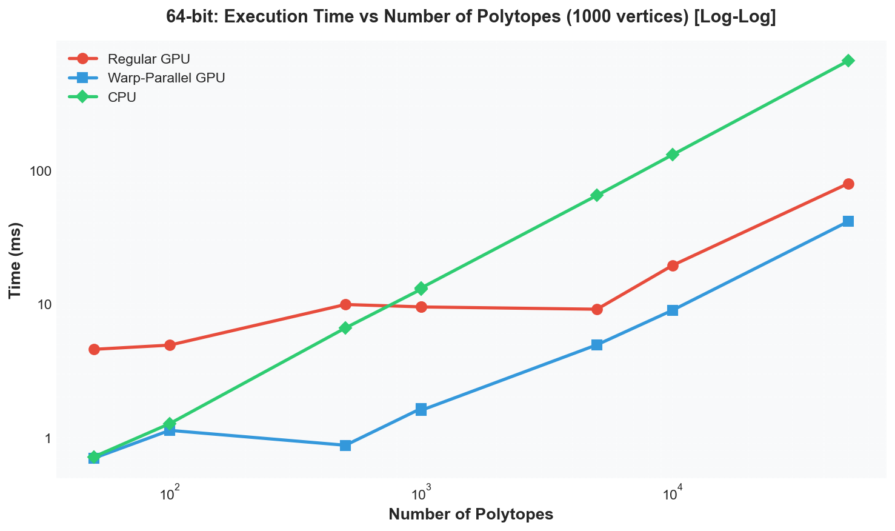
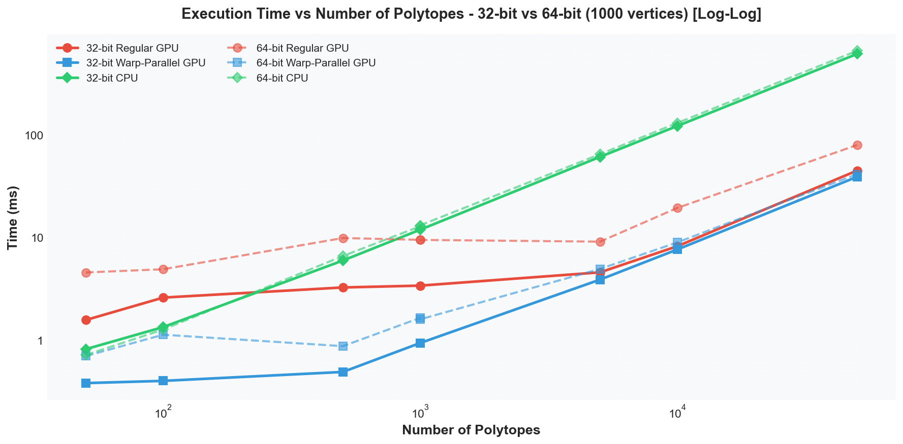
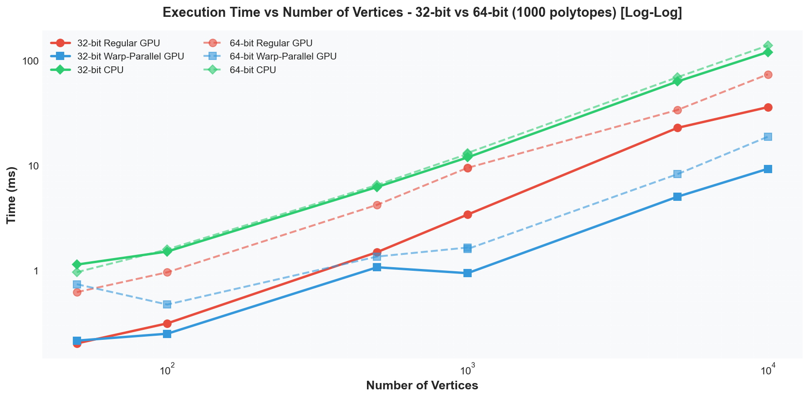
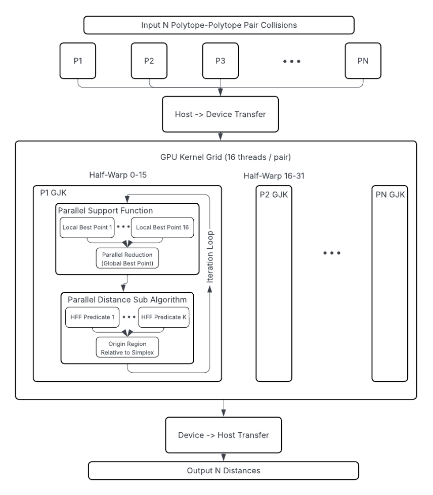
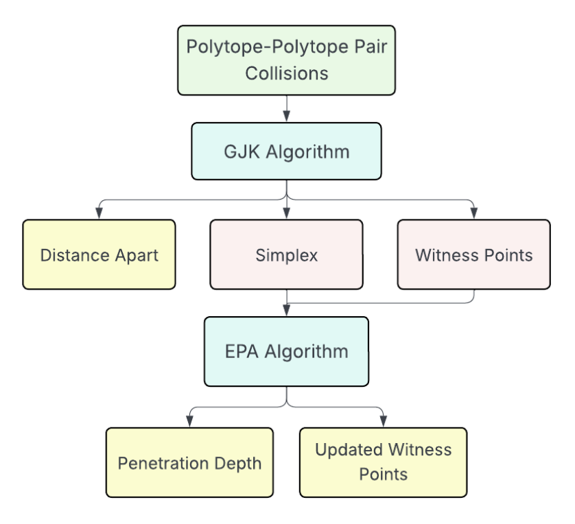

*This repo is currently a work in progress.*
# OpenGJK-GPU

CUDA implementation of [openGJK](https://github.com/MattiaMontanari/openGJK) and the EPA algorithm.

Contributors: [Marcus Hedlund](https://github.com/mhedlund7), [Vismay Churiwala](https://vismaychuriwala.com/), [Cindy Wei](https://www.linkedin.com/in/cindy-wei-7ba778227/?utm_source=share&utm_campaign=share_via&utm_content=profile&utm_medium=ios_app)
## Introduction

We aim to create an efficient and high quality open implementations of the GJK and EPA collision detection algorithms in CUDA, leveraging the GPU to achieve significant speedup over existing CPU implementations on high numbers of colliding polytopes. We also provide a physics simulation using OpenGL and Raylib for visualization to demonstrate our updated algorithms in action.

**GJK (Gilbert-Johnson-Keerthi)** is a fast iterative algorithm for computing the minimum distance between two convex polytopes in 3D space. It works by iteratively building a simplex (a point, line segment, triangle, or tetrahedron) within the Minkowski difference of the two polytopes, converging toward the closest point to the origin. GJK is widely used in collision detection, robotics, and physics simulation because it's efficient, numerically stable, and works with any convex shape.

**EPA (Expanding Polytope Algorithm)** is a complementary algorithm that computes penetration depth and witness points when two polytopes are overlapping. While GJK can detect collisions (distance = 0), EPA is needed to determine how deeply objects penetrate each other and where the contact points are, both of which are critical for collision response in physics engines.

## CPU Baseline Implementation

The CPU baseline in `GJK/cpu/` was adapted from the original openGJK to use the common flattened memory layout:

**Critical Changes:**
- **Coordinate access pattern**: Changed from `coord[i]` (double pointer) to `&coord[i * 3]` (single pointer with stride)
  - Modified in: `support()`, `W0D()`, `W1D()`, `W2D()`, `W3D()`, and `compute_minimum_distance()` initialization
- **Build system**: Added C language support to CMake for proper C compilation

## Port Summary

### Key Changes from Original openGJK

1. **Memory Layout**: Changed from double-pointer `gkFloat** coord` to flattened array `gkFloat* coord` for GPU compatibility
   - Added `getCoord(body, index, component)` macro for array access: `body->coord[(index) * 3 + (component)]`

2. **Function Decorators**: Added `__device__` to all 17 helper functions (determinant, crossProduct, S1D, S2D, S3D, support, subalgorithm, W0D-W3D, compute_witnesses)

3. **Kernel Signature**: Changed from CPU function to `__global__` kernel:
   ```cuda
   __global__ void compute_minimum_distance(const gkPolytope* polytopes1, const gkPolytope* polytopes2,
                                             gkSimplex* simplices, gkFloat* distances, const int n);
   ```

4. **Performance Optimization**: Changed to copy-by-value for polytopes and simplices to keep data in registers/local memory instead of global memory

5. **Precision Macros**: Added `gkSqrt` macro for float/double precision handling

6. **Code Structure**: GPU wrapper in `GJK::GPU` namespace with built-in CUDA timing support

7. **Warp-Parallel Implementation**: All GPU kernels use warp-parallel execution with 16 threads per collision (GJK) and 32 threads per collision (EPA). Main speedup comes from parallelizing support function calls and GJK sub-distance algorithms (S1D/S2D/S3D) across warp lanes using `__shfl_sync()` operations.

## EPA (Expanding Polytope Algorithm) Implementation

### Current Status
- **Warp-Parallel EPA**: Implemented using one warp (32 threads) per collision
- **Integration**: EPA is called automatically after GJK when a collision is detected (returned distance is 0.00)
- **Functionality**: Computes penetration depth, witness points, and contact normals for overlapping polytopes

### Key Implementation Details
- **Polytope Structure**: Uses `EPAPolytope` with up to 128 faces and dynamic vertex expansion
- **Parallel Operations**:
  - Face normal/distance computation distributed across warp threads
  - Support function calls parallelized using all 32 threads
- **Synchronization**: Lane 0 (first thread) maintains authoritative polytope state; other threads assist with parallel function calls
- **Convergence**: Iterates until penetration depth improvement is below tolerance or max iterations (64) reached

### API
```cuda
/**
 * Computes minimum distance between polytopes using GJK algorithm on GPU.
 * Handles all GPU memory allocation and transfers internally.
 *
 * @param n         Number of polytope pairs
 * @param bd1       Array of first polytopes (host memory)
 * @param bd2       Array of second polytopes (host memory)
 * @param simplices Array to store resulting simplices (host memory)
 * @param distances Array to store resulting distances (host memory)
 */
void computeDistances(const int n,
                    const gkPolytope* bd1,
                    const gkPolytope* bd2,
                    gkSimplex* simplices,
                    gkFloat* distances);

 /**
 * Computes collision information (penetration depth, witness points, and contact normal) for colliding polytopes using EPA algorithm only.
 * Takes pre-computed simplices and distances from GJK as input and runs EPA to compute
 * detailed collision information.
 * Handles all GPU memory allocation and transfers internally.
 *
 * @param n         Number of polytope pairs
 * @param bd1       Array of first polytopes (host memory)
 * @param bd2       Array of second polytopes (host memory)
 * @param simplices Array of input simplices from GJK (host memory, will be updated with results)
 * @param distances Array of input distances from GJK (host memory, will be updated with negative penetration depths for colliding objects)
 * @param witness1   Array to store witness points on first polytope (n*3 floats, host memory)
 * @param witness2   Array to store witness points on second polytope (n*3 floats, host memory)
 * @param contact_normals Optional array to store contact normals from bd1 to bd2 (n*3 floats, host memory, can be nullptr)
 */
void computeCollisionInformation(const int n,
                    const gkPolytope* bd1,
                    const gkPolytope* bd2,
                    gkSimplex* simplices,
                    gkFloat* distances,
                    gkFloat* witness1,
                    gkFloat* witness2,
                    gkFloat* contact_normals = nullptr);
```


## Usage

### Basic GJK (Distance Computation)

```cpp
#include "GJK/gpu/openGJK.h"

// Prepare polytope data
gkPolytope polytope1, polytope2;
polytope1.numpoints = numVertices1;
polytope1.coord = vertexArray1;  // Flattened: [x0, y0, z0, x1, y1, z1, ...]
polytope2.numpoints = numVertices2;
polytope2.coord = vertexArray2;

// Allocate and initialize
gkSimplex* simplices = new gkSimplex[n];
gkFloat* distances = new gkFloat[n];
for (int i = 0; i < n; i++) simplices[i].nvrtx = 0;

// Use wrapper function (handles GPU memory management)
GJK::GPU::computeDistances(n, &polytope1, &polytope2, simplices, distances);

// Results: distances[i] = minimum distance (0.0 = collision)
```

### EPA (Penetration Depth, Witness Points, and Contact Normals)

```cpp
#include "GJK/gpu/openGJK.h"

// Allocate result arrays
gkFloat* witness1 = new gkFloat[n * 3];  // Contact points on polytope1
gkFloat* witness2 = new gkFloat[n * 3];  // Contact points on polytope2
gkFloat* contact_normals = new gkFloat[n * 3];  // Contact normals (optional)

// Run EPA using simplex and distance values returned by prior GJK call
GJK::GPU::computeCollisionInformation(n, &polytope1, &polytope2, simplices, distances,
                            witness1, witness2, contact_normals);

// Results:
// - distances[i] > 0: separation distance
// - distances[i] < 0: penetration depth
// - witness1/2[i*3 to i*3+2]: contact points (x, y, z)
// - contact_normals[i*3 to i*3+2]: normal from polytope1 to polytope2
```


## Precision Configuration

To switch between 32-bit (float) and 64-bit (double) precision, edit [GJK/common.h:10](GJK/common.h#L10):
- **32-bit**: `#define USE_32BITS`
- **64-bit**: `//#define USE_32BITS`s


## Getting Started With OpenGJK-GPU

These steps walk you through building and running one of our examples uses of GJK.

This can be found in **`examples/usage/main.c`** and is a simple C/C++ example demonstrating basic GJK distance computation using the GPU API

### Prerequisites

**Required:**
- Git
- C/C++ compiler (GCC, Clang, or MSVC)
- CMake (version 3.18 or higher)
- **CUDA Toolkit** (version 11.0 or higher) - Required for GPU implementation
- **NVIDIA GPU** with CUDA support

### Building and Running

First, clone this repository:

```bash
git clone https://github.com/vismaychuriwala/OpenGJK-GPU.git
cd OpenGJK-GPU
```

Then use these commands to build and run the example:

**On Windows:**
```cmd
cmake -E make_directory build
cmake -E chdir build cmake -DCMAKE_BUILD_TYPE=Release ..
cmake --build build --config Release
cd build\bin\Release
example_lib_opengjk_ce.exe
```

The successful output should be:
```
Distance between bodies 3.653650
```

## Graphs

Performance comparison across different configurations (1000 polytopes or 1000 vertices fixed):

|||
|:--:|:--:|

Note: Linear y-axis plots compress lower timing values, making comparisons difficult. Log-log plots below show full range:

|||
|:--:|:--:|
|||
|||

The GPU implementation using warp-parallel execution is consistently faster across all test cases. Performance gains increase with the number of vertices/polytopes. Note the considerable performance differences for 64-bit precision, particularly for GPU algorithms.
## Diagrams


||
|:--:|
| *GPU Implementation Block Diagram* |

||
|:--:|
| *GJK EPA Interface Diagram* |


## Test Results

Performance comparison (1000 polytope pairs, 1000 vertices each):

```
OpenGJK Performance Testing
============================
Polytopes: 1000
Vertices per polytope: 1000
Precision: 32-bit (float)


================================================================================
                           EXECUTION TIMES
================================================================================
GPU (Warp-Parallel):       0.9624 ms
CPU:                       12.1139 ms

================================================================================
                          PERFORMANCE COMPARISON
================================================================================
CPU vs GPU:                12.59x speedup

================================================================================
                            VALIDATION RESULTS
================================================================================
GPU vs CPU:                PASSED (first 100 results within 1e-05 tolerance)

================================================================================
                            DISTANCE RESULTS
================================================================================
GPU:
  Distance (first pair):   5.655237
  Distance (last pair):    6.642425
  Witnesses (first pair):  (-3.503, 0.591, -2.867) and (1.812, 0.588, -0.935)

CPU:
  Distance (first pair):   5.655237
  Distance (last pair):    6.642425
  Witnesses (first pair):  (-3.503, 0.591, -2.867) and (1.812, 0.588, -0.935)
================================================================================

========================================
EPA Algorithm Testing
========================================

Test Case 5: Overlapping polytopes (~50 vertices each)
-----------------------------------

=== GJK Results (before EPA) ===
  Collision 0:
    Simplex vertices: 4
    Distance: 0.000000
    Witness 1: (0.501309, 0.017448, 0.503722)
    Witness 2: (0.501309, 0.017449, 0.503722)
================================

  Simplex vertices: 4
  Distance/Penetration: -0.329734
  Witness 1: (0.480366, -0.027989, 0.269849)
  Witness 2: (0.529449, 0.083507, 0.891680)
  PASS: Collision detected with penetration depth of 0.329734

========================================
EPA Testing Complete
========================================

Testing complete!
```

The validation automatically compares the first 100 distance computations between GPU and CPU implementations, confirming correctness of the GPU port.

* **Tested On:**
  * OS: Windows 11
  * CPU: AMD Ryzen 7 5800H with Radeon Graphics (8C/16T, 3.2GHz base)
  * RAM: 32GB DDR4
  * GPU: NVIDIA GeForce RTX 3060 Laptop GPU (6GB GDDR6)
  * CUDA Toolkit: 13.0
  * Driver Version: 581.80

## Deliverables
* [Project Proposal](https://docs.google.com/document/d/14fZ2E0YpqXE-DzvDsl6Hdc9iFCNBl_NMRxxjJE2w3jY/edit?usp=sharing)
* [Milestone 1](https://docs.google.com/presentation/d/1WPj8Xt3JGV5DWIja9NVG7UvrkLtkmIimTGchkGf9aNI/edit?usp=sharing)
* [Milestone 2](https://docs.google.com/presentation/d/159heWqZZO2uYQWvfda83ui7vZ1OU14n4bIfr-fYUg88/edit?usp=sharing)
* [Milestone 3](https://docs.google.com/presentation/d/1I9fcP2MQteWr0Ev3IUGg4ZLAJAGmjjiiVTp2Livz6tw/edit?usp=sharing)
* [Final Presentation](https://docs.google.com/presentation/d/1fWIkM41XUq6gc-5EAmZyqX3KbV449bzZ/edit?usp=sharing&ouid=110712747235989636284&rtpof=true&sd=true)